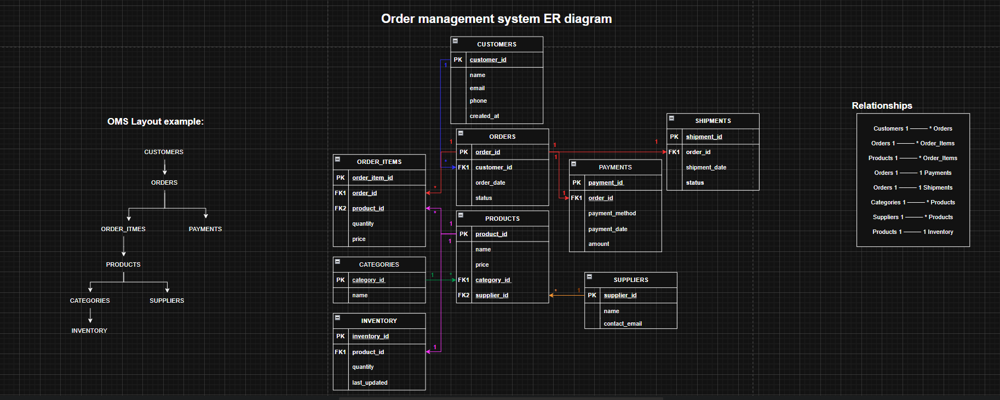

# Order Management System – Database Schema

This document describes the database schema used for the **Order Management System**.

The schema models customers placing orders for products, payments, shipments, and inventory tracking.

---

# ER Diagram

---

# Tables

## CUSTOMERS

Stores customer information.

| Column           | Type      | Description                |
| ---------------- | --------- | -------------------------- |
| customer_id (PK) | INT       | Unique customer identifier |
| name             | VARCHAR   | Customer name              |
| email            | VARCHAR   | Email address              |
| phone            | VARCHAR   | Contact number             |
| created_at       | TIMESTAMP | Account creation date      |

---

## ORDERS

Stores orders placed by customers.

| Column           | Type    | Description           |
| ---------------- | ------- | --------------------- |
| order_id (PK)    | INT     | Unique order ID       |
| customer_id (FK) | INT     | References CUSTOMERS  |
| order_date       | DATE    | Date order was placed |
| status           | VARCHAR | Order status          |

---

## ORDER_ITEMS

Stores products included in each order.

| Column             | Type    | Description         |
| ------------------ | ------- | ------------------- |
| order_item_id (PK) | INT     | Unique order item   |
| order_id (FK)      | INT     | References ORDERS   |
| product_id (FK)    | INT     | References PRODUCTS |
| quantity           | INT     | Quantity ordered    |
| price              | DECIMAL | Product price       |

---

## PRODUCTS

Stores product information.

| Column           | Type    | Description           |
| ---------------- | ------- | --------------------- |
| product_id (PK)  | INT     | Unique product ID     |
| name             | VARCHAR | Product name          |
| price            | DECIMAL | Product price         |
| category_id (FK) | INT     | References CATEGORIES |
| supplier_id (FK) | INT     | References SUPPLIERS  |

---

## CATEGORIES

Product categories.

| Column           | Type    | Description        |
| ---------------- | ------- | ------------------ |
| category_id (PK) | INT     | Unique category ID |
| name             | VARCHAR | Category name      |

---

## SUPPLIERS

Stores supplier information.

| Column           | Type    | Description        |
| ---------------- | ------- | ------------------ |
| supplier_id (PK) | INT     | Unique supplier ID |
| name             | VARCHAR | Supplier name      |
| contact_email    | VARCHAR | Supplier email     |

---

## PAYMENTS

Payment details for orders.

| Column          | Type    | Description       |
| --------------- | ------- | ----------------- |
| payment_id (PK) | INT     | Unique payment ID |
| order_id (FK)   | INT     | References ORDERS |
| payment_method  | VARCHAR | Payment method    |
| payment_date    | DATE    | Payment date      |
| amount          | DECIMAL | Payment amount    |

---

## SHIPMENTS

Shipment information for orders.

| Column           | Type    | Description        |
| ---------------- | ------- | ------------------ |
| shipment_id (PK) | INT     | Unique shipment ID |
| order_id (FK)    | INT     | References ORDERS  |
| shipment_date    | DATE    | Shipment date      |
| status           | VARCHAR | Shipment status    |

---

## INVENTORY

Tracks available product quantity.

| Column            | Type      | Description         |
| ----------------- | --------- | ------------------- |
| inventory_id (PK) | INT       | Unique inventory ID |
| product_id (FK)   | INT       | References PRODUCTS |
| quantity          | INT       | Available quantity  |
| last_updated      | TIMESTAMP | Last updated time   |

---

# Relationships

Customers 1 → * Orders
Orders 1 → * Order_Items
Products 1 → * Order_Items
Orders 1 → 1 Payments
Orders 1 → 1 Shipments
Categories 1 → * Products
Suppliers 1 → * Products
Products 1 → 1 Inventory

# Notes

• Primary Keys (PK) uniquely identify records  
• Foreign Keys (FK) enforce referential integrity  
• The schema is normalized to reduce redundancy  
• Suitable for both **MySQL and Oracle implementations**
